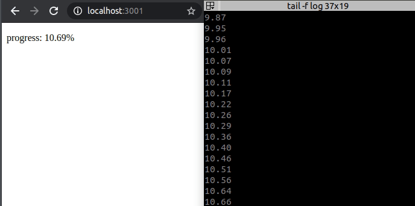

Problem
=======
Вы работаете над проектом https://clideo.com/resize-video. Frontend находится на servA, 
а обработка видео происходит на servB. В процессе обработки видео на servB непрерывно пишется лог-файл, 
из которого можно получить конкретный % прогресса обработки видео.
Как передать этот процент в браузер пользователя с минимальными задержками и нагрузкой на серверы? 

Usage
=====
`yarn install && yarn start`